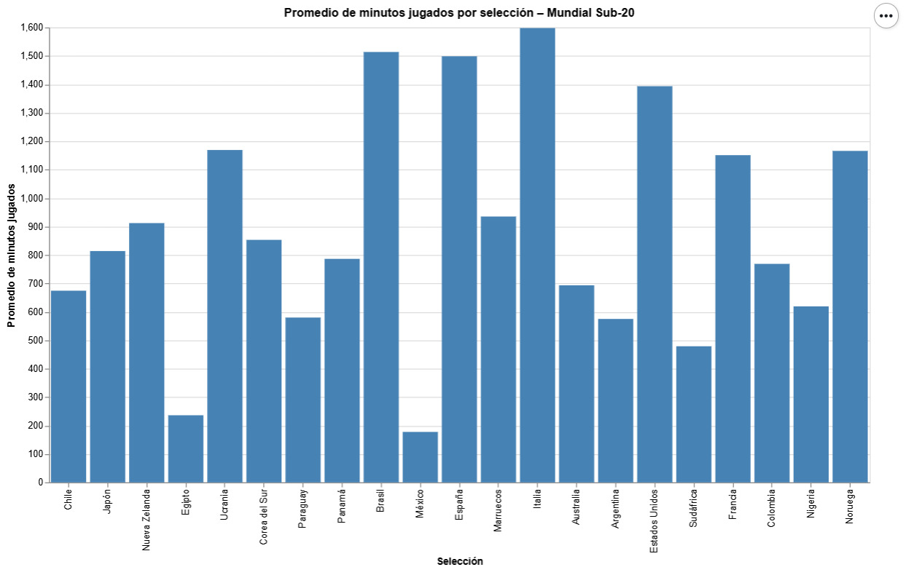

# Experiencia profesional y rendimiento en el Mundial Sub-20

Esta visualización muestra el **promedio de minutos jugados por los jugadores de cada selección** que participó en el Mundial Sub-20. Los datos fueron recopilados de las nóminas oficiales de los equipos y reflejan la experiencia acumulada en partidos profesionales antes del inicio del torneo.  

Se observa que selecciones como **Italia, Brasil y España** presentan los promedios más altos de minutos jugados, lo que indica que sus jugadores cuentan con mayor experiencia profesional. Por el contrario, equipos como **México, Egipto o Sudáfrica** muestran promedios significativamente menores, reflejando un grupo de jugadores más jóvenes o con menor participación en sus ligas profesionales.  

El objetivo de esta visualización es explorar cómo la **experiencia de los futbolistas** podría relacionarse con el **rendimiento de sus selecciones en el torneo**, en línea con nuestra hipótesis de investigación: *las selecciones con jugadores más experimentados tendrán un mejor desempeño en el Mundial Sub-20*. Aunque el torneo recién finaliza, este análisis permite comparar rápidamente los niveles de experiencia entre países y continentes, y situar a **Chile** en el contexto global.  

La visualización fue realizada con **Altair en Python**, asegurando un proceso **transparente y replicable**, donde se consolidaron datos de distintas fuentes oficiales. Los colores y las barras facilitan la comparación entre selecciones, mientras que los tooltips permiten inspeccionar los valores exactos de minutos jugados por cada equipo.  

De manera preliminar, se pueden identificar algunas tendencias: los equipos europeos y sudamericanos tienden a tener jugadores con más experiencia profesional, mientras que selecciones de otras regiones muestran promedios más bajos. Esto permite plantear interrogantes sobre cómo la experiencia acumulada podría influir en la capacidad de los equipos para enfr

[def]: image.png